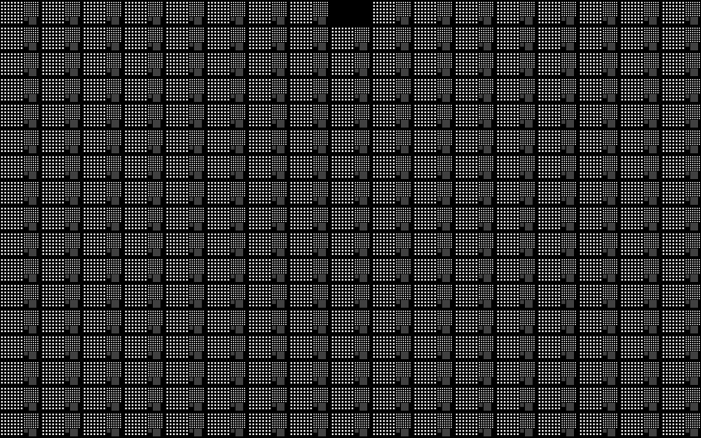

The Focus Sweep Print is a full-field calibration pattern used to determine the optimal focal distance. The print consists of 17 columns and 17 rows. Each column is printed at a different focus offset: the center column is 0 µm, while adjacent columns step outward in increments of the defined Focus Sweep Step (µm), ranging from −8× step on the far left to +8× step on the far right. Each position in the grid contains a 7×7 array of square features at multiple pixel sizes.

Because focus varies only by column, differences in feature sharpness and edge definition across columns indicate the relative quality of each focal offset. The column exhibiting the highest overall clarity identifies the optimal focal distance. This value is then used to set the global focus.

For orientation, the printed bulk includes a missing notch in the top-left corner, and the center column omits the first row of features.

