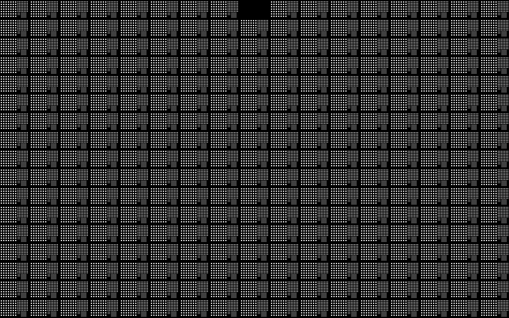

The Uniform Focus Print is a full-field calibration pattern used to evaluate focus consistency across the entire build area. The print contains square features of multiple sizes (e.g., 1, 2, 4, and 6 px) distributed evenly over the projection field, all printed at a single, fixed focus setting. The pattern consists of 17 columns and 17 rows, with each position containing a 7×7 grid of features at each size.

Because the focus setting is held constant, any variation in feature sharpness or edge definition across the build area reveals focal plane misalignment relative to the print surface. This print is intended for diagnostic evaluation; calibration is performed using other calibration prints.

